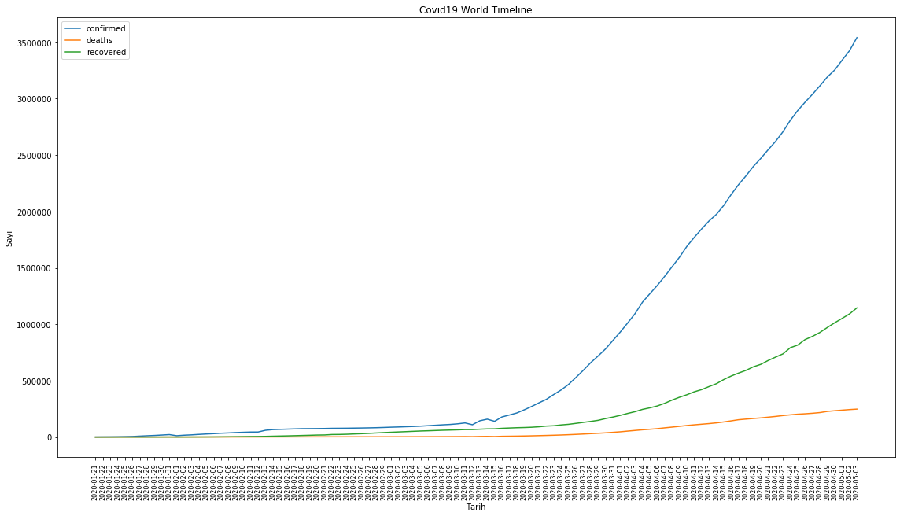
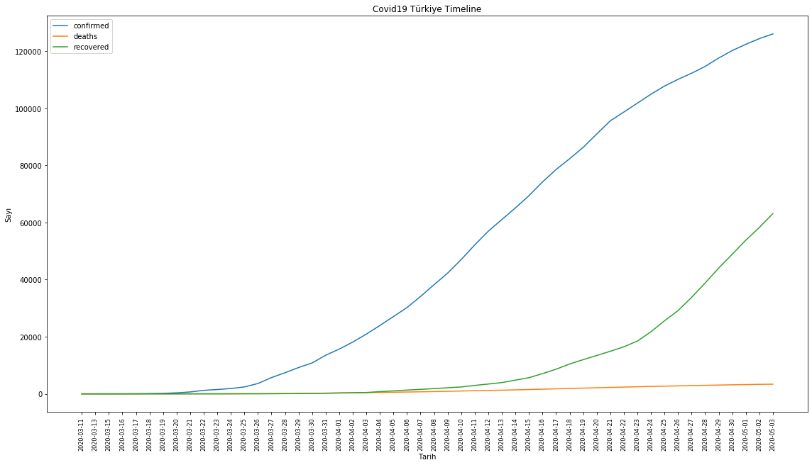
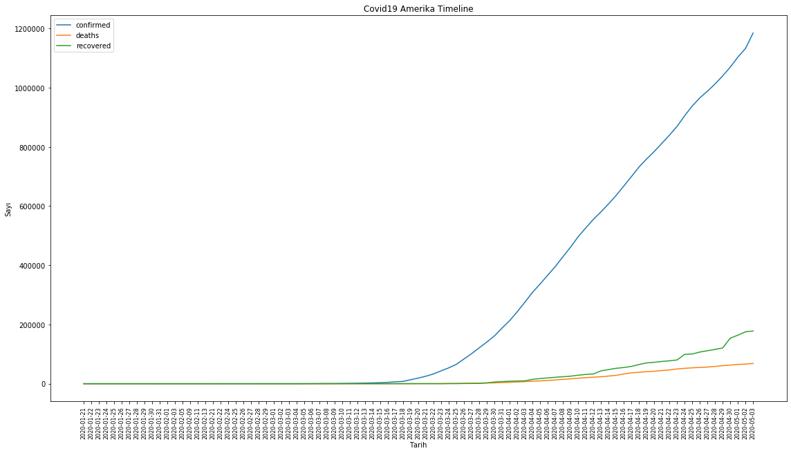
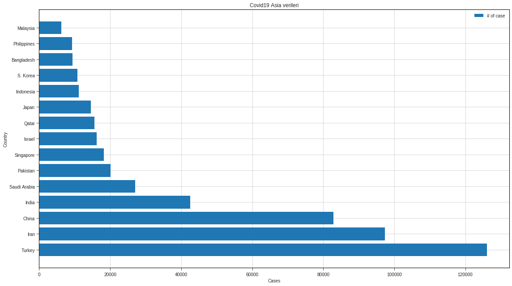
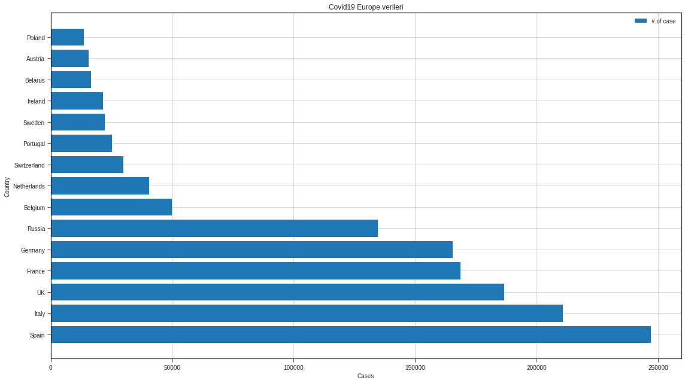
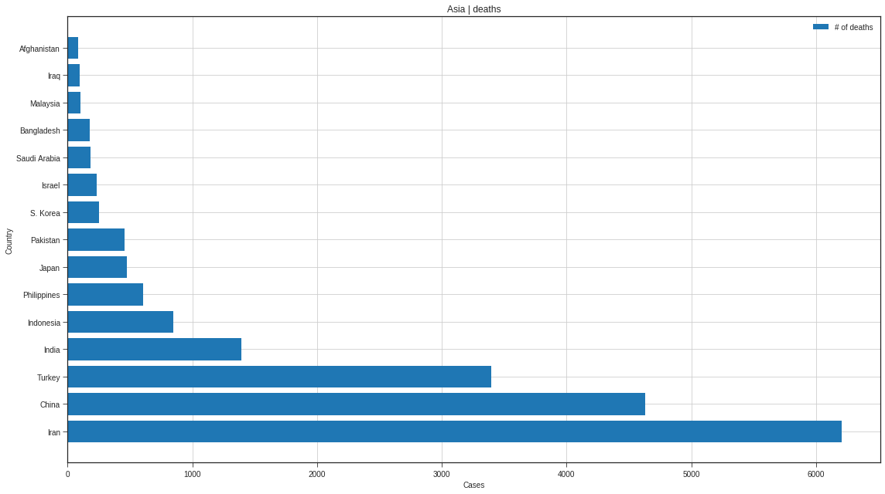
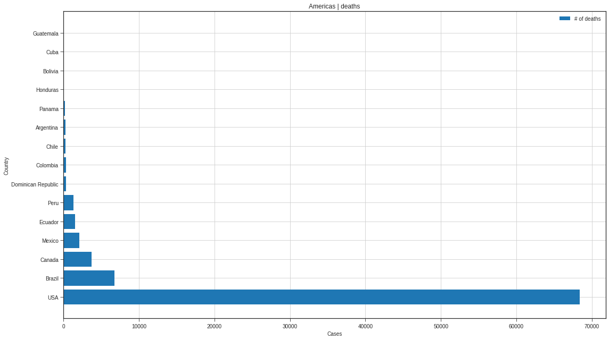
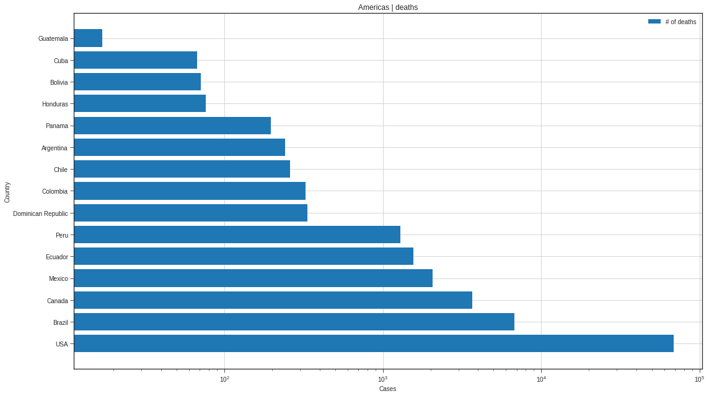
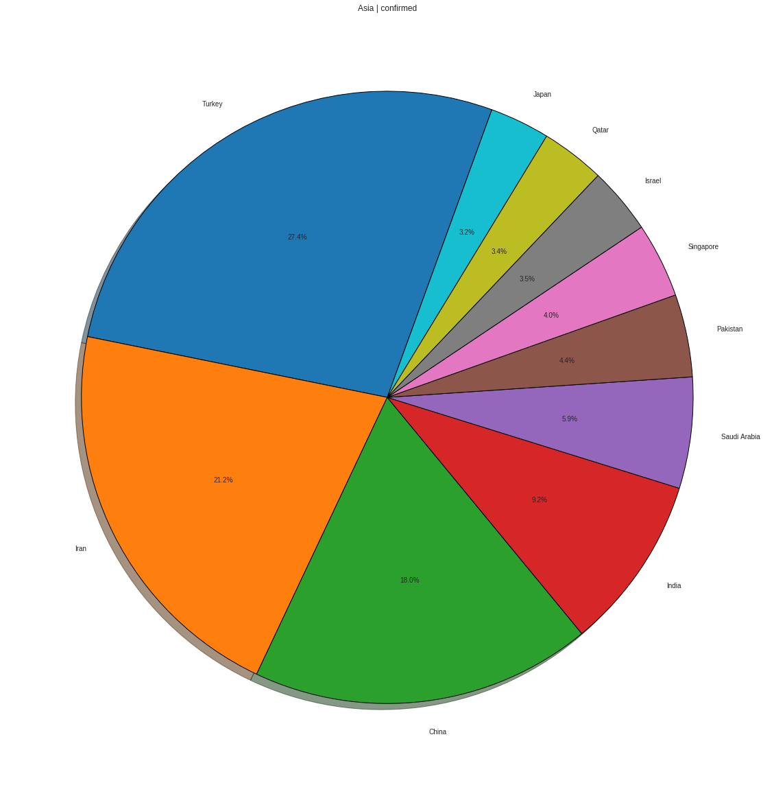
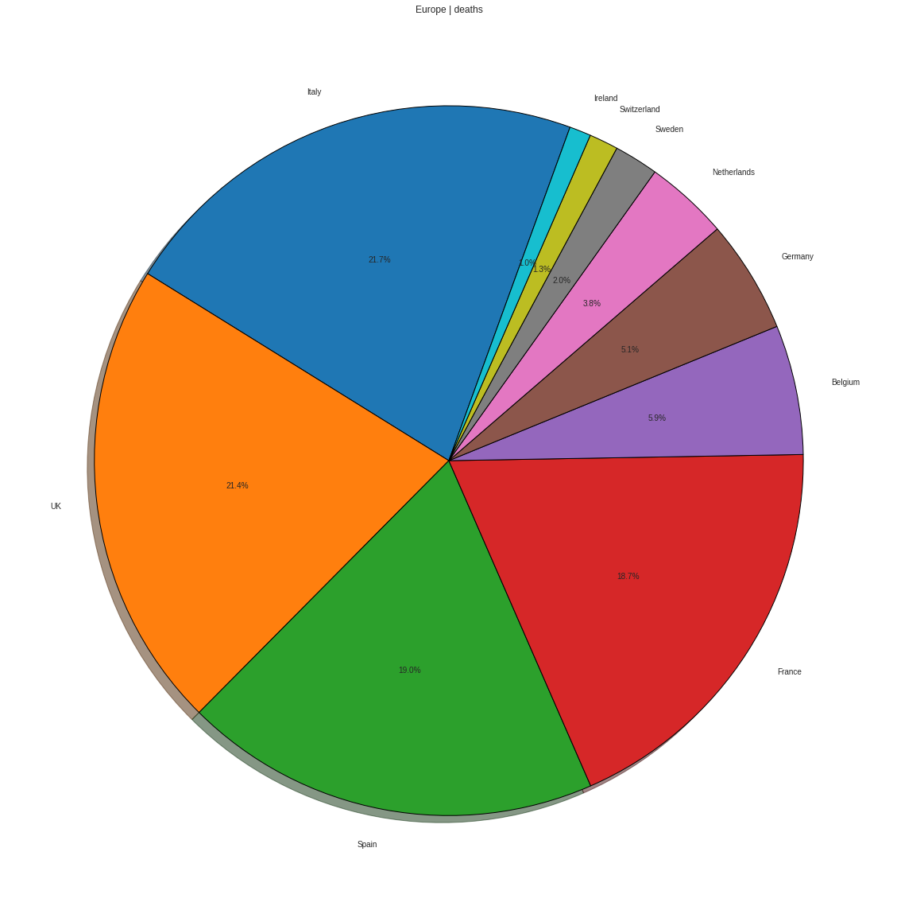

# Covid 19 Data Visualization 

Dünyanın ve ülkelerin zamana bağlı değişim grafikleri ve kıtalara göre ülkelerdeki vaka, ölüm verilerini görselleştirdim.

Verileri çektiğim api'da güncel covid19 verileri, regions.csv dosyasında ise ülkelerin bulunduğu kıtaların listesi mevcut. Bu iki veri setini birleştirip ülkelerin güncel covid19 durumunu kıtalara göre grupladım. 

Grafikler inline olduğu için detayı gözükmüyor, jupyterde açıp %matplotlib qt komutunu girerseniz farklı bir pencerede açılır, yaklaştırıp uzaklaştırabilirsiniz.


```python
import pandas as pd
import json
import requests
from pandas import json_normalize
from matplotlib import pyplot as plt
```


### Api verileri çok karmaşık sunuyor, manuel olarak parse etmek saçma olacağı için json_normalize methoduyla parse ettim


```python
response = requests.get('https://corona-api.com/countries').json()['data']
```

### Api'de 248 ülkeye ait:
* Vaka Sayıları
* Ölüm Sayıları
* İyileşen Sayıları
* Timeline verileri mevcut, işimize yaramayacak başka verilerde var, az sonra temizleyeceğim.
 


```python
covid = json_normalize(response)
```


```python
covid.shape
```


    (249, 16)


```python
covid.head(10)
```


<div>
<style scoped>
    .dataframe tbody tr th:only-of-type {
        vertical-align: middle;
    }

    .dataframe tbody tr th {
        vertical-align: top;
    }

    .dataframe thead th {
        text-align: right;
    }
</style>
<table border="1" class="dataframe">
  <thead>
    <tr style="text-align: right;">
      <th></th>
      <th>name</th>
      <th>code</th>
      <th>population</th>
      <th>updated_at</th>
      <th>coordinates.latitude</th>
      <th>coordinates.longitude</th>
      <th>today.deaths</th>
      <th>today.confirmed</th>
      <th>latest_data.deaths</th>
      <th>latest_data.confirmed</th>
      <th>latest_data.recovered</th>
      <th>latest_data.critical</th>
      <th>latest_data.calculated.death_rate</th>
      <th>latest_data.calculated.recovery_rate</th>
      <th>latest_data.calculated.recovered_vs_death_ratio</th>
      <th>latest_data.calculated.cases_per_million_population</th>
    </tr>
  </thead>
  <tbody>
    <tr>
      <th>0</th>
      <td>Afghanistan</td>
      <td>AF</td>
      <td>29121286.0</td>
      <td>2020-05-03T20:45:01.303Z</td>
      <td>33.00</td>
      <td>65.0</td>
      <td>13</td>
      <td>235</td>
      <td>85</td>
      <td>2704</td>
      <td>345</td>
      <td>7</td>
      <td>3.143491</td>
      <td>12.758876</td>
      <td>None</td>
      <td>69.0</td>
    </tr>
    <tr>
      <th>1</th>
      <td>Albania</td>
      <td>AL</td>
      <td>2986952.0</td>
      <td>2020-05-03T20:45:01.303Z</td>
      <td>41.00</td>
      <td>20.0</td>
      <td>0</td>
      <td>6</td>
      <td>31</td>
      <td>795</td>
      <td>531</td>
      <td>7</td>
      <td>3.899371</td>
      <td>66.792453</td>
      <td>None</td>
      <td>276.0</td>
    </tr>
    <tr>
      <th>2</th>
      <td>Åland Islands</td>
      <td>AX</td>
      <td>26711.0</td>
      <td>2020-05-03T20:45:01.303Z</td>
      <td>0.00</td>
      <td>0.0</td>
      <td>0</td>
      <td>0</td>
      <td>0</td>
      <td>0</td>
      <td>0</td>
      <td>0</td>
      <td>NaN</td>
      <td>NaN</td>
      <td>None</td>
      <td>0.0</td>
    </tr>
    <tr>
      <th>3</th>
      <td>American Samoa</td>
      <td>AS</td>
      <td>57881.0</td>
      <td>2020-05-03T20:45:01.303Z</td>
      <td>0.00</td>
      <td>0.0</td>
      <td>0</td>
      <td>0</td>
      <td>0</td>
      <td>0</td>
      <td>0</td>
      <td>0</td>
      <td>NaN</td>
      <td>NaN</td>
      <td>None</td>
      <td>0.0</td>
    </tr>
    <tr>
      <th>4</th>
      <td>Algeria</td>
      <td>DZ</td>
      <td>34586184.0</td>
      <td>2020-05-03T20:45:01.303Z</td>
      <td>28.00</td>
      <td>3.0</td>
      <td>4</td>
      <td>179</td>
      <td>463</td>
      <td>4474</td>
      <td>1936</td>
      <td>22</td>
      <td>10.348681</td>
      <td>43.272240</td>
      <td>None</td>
      <td>102.0</td>
    </tr>
    <tr>
      <th>5</th>
      <td>Andorra</td>
      <td>AD</td>
      <td>84000.0</td>
      <td>2020-05-03T20:45:01.303Z</td>
      <td>42.50</td>
      <td>1.6</td>
      <td>0</td>
      <td>0</td>
      <td>44</td>
      <td>747</td>
      <td>472</td>
      <td>17</td>
      <td>5.890228</td>
      <td>63.186078</td>
      <td>None</td>
      <td>9668.0</td>
    </tr>
    <tr>
      <th>6</th>
      <td>Angola</td>
      <td>AO</td>
      <td>13068161.0</td>
      <td>2020-05-03T20:45:01.303Z</td>
      <td>0.00</td>
      <td>0.0</td>
      <td>0</td>
      <td>0</td>
      <td>2</td>
      <td>35</td>
      <td>11</td>
      <td>0</td>
      <td>5.714286</td>
      <td>31.428571</td>
      <td>None</td>
      <td>1.0</td>
    </tr>
    <tr>
      <th>7</th>
      <td>Anguilla</td>
      <td>AI</td>
      <td>13254.0</td>
      <td>2020-05-03T20:45:01.303Z</td>
      <td>0.00</td>
      <td>0.0</td>
      <td>0</td>
      <td>0</td>
      <td>0</td>
      <td>3</td>
      <td>3</td>
      <td>0</td>
      <td>0.000000</td>
      <td>100.000000</td>
      <td>None</td>
      <td>200.0</td>
    </tr>
    <tr>
      <th>8</th>
      <td>Antigua and Barbuda</td>
      <td>AG</td>
      <td>86754.0</td>
      <td>2020-05-03T20:45:01.303Z</td>
      <td>17.05</td>
      <td>-61.8</td>
      <td>0</td>
      <td>0</td>
      <td>3</td>
      <td>25</td>
      <td>15</td>
      <td>1</td>
      <td>12.000000</td>
      <td>60.000000</td>
      <td>None</td>
      <td>255.0</td>
    </tr>
    <tr>
      <th>9</th>
      <td>Antarctica</td>
      <td>AQ</td>
      <td>NaN</td>
      <td>2020-05-03T20:45:01.303Z</td>
      <td>0.00</td>
      <td>0.0</td>
      <td>0</td>
      <td>0</td>
      <td>0</td>
      <td>0</td>
      <td>0</td>
      <td>0</td>
      <td>NaN</td>
      <td>NaN</td>
      <td>None</td>
      <td>0.0</td>
    </tr>
  </tbody>
</table>
</div>


latest_data -> Toplam veriyi ifade ediyor

### Gereksiz bilgileri silebiliriz

Elimizde ülkelerin günlük ve toplam covid19 verileri gibi gerekli bilgiler olduğu gibi, koordinat ve güncelleme gibi gereksiz bilgilerde var.Bunlardan kurtulmak istiyorum.


```python
covid.drop(['updated_at','coordinates.latitude','coordinates.longitude','latest_data.calculated.recovered_vs_death_ratio',],
           axis = 1, inplace=True)
```


```python
covid.head()
```


<div>
<style scoped>
    .dataframe tbody tr th:only-of-type {
        vertical-align: middle;
    }

    .dataframe tbody tr th {
        vertical-align: top;
    }

    .dataframe thead th {
        text-align: right;
    }
</style>
<table border="1" class="dataframe">
  <thead>
    <tr style="text-align: right;">
      <th></th>
      <th>name</th>
      <th>code</th>
      <th>population</th>
      <th>today.deaths</th>
      <th>today.confirmed</th>
      <th>latest_data.deaths</th>
      <th>latest_data.confirmed</th>
      <th>latest_data.recovered</th>
      <th>latest_data.critical</th>
      <th>latest_data.calculated.death_rate</th>
      <th>latest_data.calculated.recovery_rate</th>
      <th>latest_data.calculated.cases_per_million_population</th>
    </tr>
  </thead>
  <tbody>
    <tr>
      <th>0</th>
      <td>Afghanistan</td>
      <td>AF</td>
      <td>29121286.0</td>
      <td>13</td>
      <td>235</td>
      <td>85</td>
      <td>2704</td>
      <td>345</td>
      <td>7</td>
      <td>3.143491</td>
      <td>12.758876</td>
      <td>69.0</td>
    </tr>
    <tr>
      <th>1</th>
      <td>Albania</td>
      <td>AL</td>
      <td>2986952.0</td>
      <td>0</td>
      <td>6</td>
      <td>31</td>
      <td>795</td>
      <td>531</td>
      <td>7</td>
      <td>3.899371</td>
      <td>66.792453</td>
      <td>276.0</td>
    </tr>
    <tr>
      <th>2</th>
      <td>Åland Islands</td>
      <td>AX</td>
      <td>26711.0</td>
      <td>0</td>
      <td>0</td>
      <td>0</td>
      <td>0</td>
      <td>0</td>
      <td>0</td>
      <td>NaN</td>
      <td>NaN</td>
      <td>0.0</td>
    </tr>
    <tr>
      <th>3</th>
      <td>American Samoa</td>
      <td>AS</td>
      <td>57881.0</td>
      <td>0</td>
      <td>0</td>
      <td>0</td>
      <td>0</td>
      <td>0</td>
      <td>0</td>
      <td>NaN</td>
      <td>NaN</td>
      <td>0.0</td>
    </tr>
    <tr>
      <th>4</th>
      <td>Algeria</td>
      <td>DZ</td>
      <td>34586184.0</td>
      <td>4</td>
      <td>179</td>
      <td>463</td>
      <td>4474</td>
      <td>1936</td>
      <td>22</td>
      <td>10.348681</td>
      <td>43.272240</td>
      <td>102.0</td>
    </tr>
  </tbody>
</table>
</div>


### Kıtaları çekiyorum

Ülkelerin bulunduğu kıtaları regions.csv dosyasından çekiyorum


```python
data = pd.read_csv('../input/country-mapping-iso-continent-region/continents2.csv')
```


```python
regions = pd.DataFrame(data)
```


```python
regions.head()
```


<div>
<style scoped>
    .dataframe tbody tr th:only-of-type {
        vertical-align: middle;
    }

    .dataframe tbody tr th {
        vertical-align: top;
    }

    .dataframe thead th {
        text-align: right;
    }
</style>
<table border="1" class="dataframe">
  <thead>
    <tr style="text-align: right;">
      <th></th>
      <th>name</th>
      <th>alpha-2</th>
      <th>alpha-3</th>
      <th>country-code</th>
      <th>iso_3166-2</th>
      <th>region</th>
      <th>sub-region</th>
      <th>intermediate-region</th>
      <th>region-code</th>
      <th>sub-region-code</th>
      <th>intermediate-region-code</th>
    </tr>
  </thead>
  <tbody>
    <tr>
      <th>0</th>
      <td>Afghanistan</td>
      <td>AF</td>
      <td>AFG</td>
      <td>4</td>
      <td>ISO 3166-2:AF</td>
      <td>Asia</td>
      <td>Southern Asia</td>
      <td>NaN</td>
      <td>142.0</td>
      <td>34.0</td>
      <td>NaN</td>
    </tr>
    <tr>
      <th>1</th>
      <td>Åland Islands</td>
      <td>AX</td>
      <td>ALA</td>
      <td>248</td>
      <td>ISO 3166-2:AX</td>
      <td>Europe</td>
      <td>Northern Europe</td>
      <td>NaN</td>
      <td>150.0</td>
      <td>154.0</td>
      <td>NaN</td>
    </tr>
    <tr>
      <th>2</th>
      <td>Albania</td>
      <td>AL</td>
      <td>ALB</td>
      <td>8</td>
      <td>ISO 3166-2:AL</td>
      <td>Europe</td>
      <td>Southern Europe</td>
      <td>NaN</td>
      <td>150.0</td>
      <td>39.0</td>
      <td>NaN</td>
    </tr>
    <tr>
      <th>3</th>
      <td>Algeria</td>
      <td>DZ</td>
      <td>DZA</td>
      <td>12</td>
      <td>ISO 3166-2:DZ</td>
      <td>Africa</td>
      <td>Northern Africa</td>
      <td>NaN</td>
      <td>2.0</td>
      <td>15.0</td>
      <td>NaN</td>
    </tr>
    <tr>
      <th>4</th>
      <td>American Samoa</td>
      <td>AS</td>
      <td>ASM</td>
      <td>16</td>
      <td>ISO 3166-2:AS</td>
      <td>Oceania</td>
      <td>Polynesia</td>
      <td>NaN</td>
      <td>9.0</td>
      <td>61.0</td>
      <td>NaN</td>
    </tr>
  </tbody>
</table>
</div>


Bu veri setinde ihtiyaç duyduğum tek şey ülkelerin alpha2 kodu ve bulundukları kıtalar, işime yaramayan sütunlardan kurtuluyorum.


```python
cols_to_keep = ['alpha-2','region']
```


```python
regions = regions[cols_to_keep]
```


```python
regions.head()
```


<div>
<style scoped>
    .dataframe tbody tr th:only-of-type {
        vertical-align: middle;
    }

    .dataframe tbody tr th {
        vertical-align: top;
    }

    .dataframe thead th {
        text-align: right;
    }
</style>
<table border="1" class="dataframe">
  <thead>
    <tr style="text-align: right;">
      <th></th>
      <th>alpha-2</th>
      <th>region</th>
    </tr>
  </thead>
  <tbody>
    <tr>
      <th>0</th>
      <td>AF</td>
      <td>Asia</td>
    </tr>
    <tr>
      <th>1</th>
      <td>AX</td>
      <td>Europe</td>
    </tr>
    <tr>
      <th>2</th>
      <td>AL</td>
      <td>Europe</td>
    </tr>
    <tr>
      <th>3</th>
      <td>DZ</td>
      <td>Africa</td>
    </tr>
    <tr>
      <th>4</th>
      <td>AS</td>
      <td>Oceania</td>
    </tr>
  </tbody>
</table>
</div>


### Covid verileriyle kıta verilerini birleştiriyorum

Merge işlemini ülkelerin ISO kodlarına göre yapacağım.Covid verilerinin bulunduğu DataFrame'de ISO kodlarını tuttuğum sütunun ismi code , regions adlı DataFrame'de ise alpha-2. Merge işlemini yapabilmek için alpha-2 adlı sütunun ismini code yapıyorum. 


```python
regions.rename(columns = {'alpha-2':'code'}, inplace = True)
```


```python
data = covid.merge(regions , on='code')
```

### Ülkeleri vaka sayısına göre sıralıyorum


```python
data.sort_values(by="latest_data.confirmed", ascending=False, inplace=True)
```


```python
data.reset_index(inplace=True)
```


```python
del data['index']
```


```python
data
```


<div>
<style scoped>
    .dataframe tbody tr th:only-of-type {
        vertical-align: middle;
    }

    .dataframe tbody tr th {
        vertical-align: top;
    }

    .dataframe thead th {
        text-align: right;
    }
</style>
<table border="1" class="dataframe">
  <thead>
    <tr style="text-align: right;">
      <th></th>
      <th>name</th>
      <th>code</th>
      <th>population</th>
      <th>today.deaths</th>
      <th>today.confirmed</th>
      <th>latest_data.deaths</th>
      <th>latest_data.confirmed</th>
      <th>latest_data.recovered</th>
      <th>latest_data.critical</th>
      <th>latest_data.calculated.death_rate</th>
      <th>latest_data.calculated.recovery_rate</th>
      <th>latest_data.calculated.cases_per_million_population</th>
      <th>region</th>
    </tr>
  </thead>
  <tbody>
    <tr>
      <th>0</th>
      <td>USA</td>
      <td>US</td>
      <td>310232863.0</td>
      <td>963</td>
      <td>23937</td>
      <td>68407</td>
      <td>1184711</td>
      <td>178219</td>
      <td>16139</td>
      <td>5.774151</td>
      <td>15.043247</td>
      <td>3579.0</td>
      <td>Americas</td>
    </tr>
    <tr>
      <th>1</th>
      <td>Spain</td>
      <td>ES</td>
      <td>46505963.0</td>
      <td>164</td>
      <td>1533</td>
      <td>25264</td>
      <td>247122</td>
      <td>148558</td>
      <td>2386</td>
      <td>10.223291</td>
      <td>60.115247</td>
      <td>5285.0</td>
      <td>Europe</td>
    </tr>
    <tr>
      <th>2</th>
      <td>Italy</td>
      <td>IT</td>
      <td>60340328.0</td>
      <td>174</td>
      <td>1389</td>
      <td>28884</td>
      <td>210717</td>
      <td>81654</td>
      <td>1501</td>
      <td>13.707484</td>
      <td>38.750552</td>
      <td>3485.0</td>
      <td>Europe</td>
    </tr>
    <tr>
      <th>3</th>
      <td>UK</td>
      <td>GB</td>
      <td>62348447.0</td>
      <td>315</td>
      <td>4339</td>
      <td>28446</td>
      <td>186599</td>
      <td>0</td>
      <td>1559</td>
      <td>15.244455</td>
      <td>0.000000</td>
      <td>2749.0</td>
      <td>Europe</td>
    </tr>
    <tr>
      <th>4</th>
      <td>France</td>
      <td>FR</td>
      <td>64768389.0</td>
      <td>135</td>
      <td>297</td>
      <td>24895</td>
      <td>168693</td>
      <td>50784</td>
      <td>3819</td>
      <td>14.757577</td>
      <td>30.104391</td>
      <td>2584.0</td>
      <td>Europe</td>
    </tr>
    <tr>
      <th>...</th>
      <td>...</td>
      <td>...</td>
      <td>...</td>
      <td>...</td>
      <td>...</td>
      <td>...</td>
      <td>...</td>
      <td>...</td>
      <td>...</td>
      <td>...</td>
      <td>...</td>
      <td>...</td>
      <td>...</td>
    </tr>
    <tr>
      <th>243</th>
      <td>Korea, Democratic People's Republic of</td>
      <td>KP</td>
      <td>22912177.0</td>
      <td>0</td>
      <td>0</td>
      <td>0</td>
      <td>0</td>
      <td>0</td>
      <td>0</td>
      <td>NaN</td>
      <td>NaN</td>
      <td>0.0</td>
      <td>Asia</td>
    </tr>
    <tr>
      <th>244</th>
      <td>Cape Verde</td>
      <td>CV</td>
      <td>508659.0</td>
      <td>0</td>
      <td>0</td>
      <td>0</td>
      <td>0</td>
      <td>0</td>
      <td>0</td>
      <td>NaN</td>
      <td>NaN</td>
      <td>0.0</td>
      <td>Africa</td>
    </tr>
    <tr>
      <th>245</th>
      <td>Cook Islands</td>
      <td>CK</td>
      <td>21388.0</td>
      <td>0</td>
      <td>0</td>
      <td>0</td>
      <td>0</td>
      <td>0</td>
      <td>0</td>
      <td>NaN</td>
      <td>NaN</td>
      <td>0.0</td>
      <td>Oceania</td>
    </tr>
    <tr>
      <th>246</th>
      <td>Jersey</td>
      <td>JE</td>
      <td>90812.0</td>
      <td>0</td>
      <td>0</td>
      <td>0</td>
      <td>0</td>
      <td>0</td>
      <td>0</td>
      <td>NaN</td>
      <td>NaN</td>
      <td>0.0</td>
      <td>Europe</td>
    </tr>
    <tr>
      <th>247</th>
      <td>Tuvalu</td>
      <td>TV</td>
      <td>10472.0</td>
      <td>0</td>
      <td>0</td>
      <td>0</td>
      <td>0</td>
      <td>0</td>
      <td>0</td>
      <td>NaN</td>
      <td>NaN</td>
      <td>0.0</td>
      <td>Oceania</td>
    </tr>
  </tbody>
</table>
<p>248 rows × 13 columns</p>
</div>


### Ölüm oranı NaN olan ülkelerde vaka yok, bu ülkeleri silebiliriz


```python
data.dropna(subset=['latest_data.calculated.death_rate'],inplace=True)
```


```python
data.shape
```


    (205, 13)


Ülke sayısı 248'den 205'e düştü

### Ülkeleri kıtalara göre grupluyorum


```python
data["region"].value_counts()
```


    Americas    52
    Africa      52
    Asia        48
    Europe      46
    Oceania      7
    Name: region, dtype: int64


```python
grouped_data = data.groupby(["region"])
```


```python
grouped_data.get_group("Asia")
```


<div>
<style scoped>
    .dataframe tbody tr th:only-of-type {
        vertical-align: middle;
    }

    .dataframe tbody tr th {
        vertical-align: top;
    }

    .dataframe thead th {
        text-align: right;
    }
</style>
<table border="1" class="dataframe">
  <thead>
    <tr style="text-align: right;">
      <th></th>
      <th>name</th>
      <th>code</th>
      <th>population</th>
      <th>today.deaths</th>
      <th>today.confirmed</th>
      <th>latest_data.deaths</th>
      <th>latest_data.confirmed</th>
      <th>latest_data.recovered</th>
      <th>latest_data.critical</th>
      <th>latest_data.calculated.death_rate</th>
      <th>latest_data.calculated.recovery_rate</th>
      <th>latest_data.calculated.cases_per_million_population</th>
      <th>region</th>
    </tr>
  </thead>
  <tbody>
    <tr>
      <th>7</th>
      <td>Turkey</td>
      <td>TR</td>
      <td>7.780412e+07</td>
      <td>61</td>
      <td>1670</td>
      <td>3397</td>
      <td>126045</td>
      <td>63151</td>
      <td>1424</td>
      <td>2.695069</td>
      <td>50.101948</td>
      <td>1495.0</td>
      <td>Asia</td>
    </tr>
    <tr>
      <th>9</th>
      <td>Iran</td>
      <td>IR</td>
      <td>7.692330e+07</td>
      <td>47</td>
      <td>976</td>
      <td>6203</td>
      <td>97424</td>
      <td>78422</td>
      <td>2690</td>
      <td>6.367014</td>
      <td>80.495566</td>
      <td>1160.0</td>
      <td>Asia</td>
    </tr>
    <tr>
      <th>10</th>
      <td>China</td>
      <td>CN</td>
      <td>1.330044e+09</td>
      <td>0</td>
      <td>2</td>
      <td>4633</td>
      <td>82877</td>
      <td>77713</td>
      <td>34</td>
      <td>5.590212</td>
      <td>93.769079</td>
      <td>58.0</td>
      <td>Asia</td>
    </tr>
    <tr>
      <th>14</th>
      <td>India</td>
      <td>IN</td>
      <td>1.173108e+09</td>
      <td>68</td>
      <td>2806</td>
      <td>1391</td>
      <td>42505</td>
      <td>11775</td>
      <td>0</td>
      <td>3.272556</td>
      <td>27.702623</td>
      <td>31.0</td>
      <td>Asia</td>
    </tr>
    <tr>
      <th>18</th>
      <td>Saudi Arabia</td>
      <td>SA</td>
      <td>2.573178e+07</td>
      <td>8</td>
      <td>1552</td>
      <td>184</td>
      <td>27011</td>
      <td>4134</td>
      <td>139</td>
      <td>0.681204</td>
      <td>15.304876</td>
      <td>776.0</td>
      <td>Asia</td>
    </tr>
    <tr>
      <th>23</th>
      <td>Pakistan</td>
      <td>PK</td>
      <td>1.844048e+08</td>
      <td>20</td>
      <td>1062</td>
      <td>457</td>
      <td>20084</td>
      <td>5114</td>
      <td>111</td>
      <td>2.275443</td>
      <td>25.463055</td>
      <td>91.0</td>
      <td>Asia</td>
    </tr>
    <tr>
      <th>25</th>
      <td>Singapore</td>
      <td>SG</td>
      <td>4.701069e+06</td>
      <td>1</td>
      <td>657</td>
      <td>18</td>
      <td>18205</td>
      <td>1408</td>
      <td>22</td>
      <td>0.098874</td>
      <td>7.734139</td>
      <td>3112.0</td>
      <td>Asia</td>
    </tr>
    <tr>
      <th>27</th>
      <td>Israel</td>
      <td>IL</td>
      <td>7.353985e+06</td>
      <td>3</td>
      <td>23</td>
      <td>232</td>
      <td>16208</td>
      <td>9749</td>
      <td>103</td>
      <td>1.431392</td>
      <td>60.149309</td>
      <td>1873.0</td>
      <td>Asia</td>
    </tr>
    <tr>
      <th>29</th>
      <td>Qatar</td>
      <td>QA</td>
      <td>8.409260e+05</td>
      <td>0</td>
      <td>679</td>
      <td>12</td>
      <td>15551</td>
      <td>1664</td>
      <td>72</td>
      <td>0.077165</td>
      <td>10.700277</td>
      <td>5398.0</td>
      <td>Asia</td>
    </tr>
    <tr>
      <th>30</th>
      <td>Japan</td>
      <td>JP</td>
      <td>1.272880e+08</td>
      <td>0</td>
      <td>0</td>
      <td>474</td>
      <td>14571</td>
      <td>3205</td>
      <td>324</td>
      <td>3.253037</td>
      <td>21.995745</td>
      <td>115.0</td>
      <td>Asia</td>
    </tr>
    <tr>
      <th>34</th>
      <td>Indonesia</td>
      <td>ID</td>
      <td>2.429683e+08</td>
      <td>14</td>
      <td>349</td>
      <td>845</td>
      <td>11192</td>
      <td>1876</td>
      <td>0</td>
      <td>7.550036</td>
      <td>16.761973</td>
      <td>41.0</td>
      <td>Asia</td>
    </tr>
    <tr>
      <th>35</th>
      <td>S. Korea</td>
      <td>KR</td>
      <td>4.842264e+07</td>
      <td>0</td>
      <td>13</td>
      <td>250</td>
      <td>10793</td>
      <td>9183</td>
      <td>55</td>
      <td>2.316316</td>
      <td>85.082924</td>
      <td>211.0</td>
      <td>Asia</td>
    </tr>
    <tr>
      <th>38</th>
      <td>Bangladesh</td>
      <td>BD</td>
      <td>1.561185e+08</td>
      <td>2</td>
      <td>665</td>
      <td>177</td>
      <td>9455</td>
      <td>1063</td>
      <td>1</td>
      <td>1.872025</td>
      <td>11.242729</td>
      <td>57.0</td>
      <td>Asia</td>
    </tr>
    <tr>
      <th>39</th>
      <td>Philippines</td>
      <td>PH</td>
      <td>9.990018e+07</td>
      <td>4</td>
      <td>295</td>
      <td>607</td>
      <td>9223</td>
      <td>1214</td>
      <td>31</td>
      <td>6.581373</td>
      <td>13.162745</td>
      <td>84.0</td>
      <td>Asia</td>
    </tr>
    <tr>
      <th>48</th>
      <td>Malaysia</td>
      <td>MY</td>
      <td>2.827473e+07</td>
      <td>2</td>
      <td>122</td>
      <td>105</td>
      <td>6298</td>
      <td>4413</td>
      <td>27</td>
      <td>1.667196</td>
      <td>70.069863</td>
      <td>195.0</td>
      <td>Asia</td>
    </tr>
    <tr>
      <th>50</th>
      <td>Kuwait</td>
      <td>KW</td>
      <td>2.789132e+06</td>
      <td>5</td>
      <td>364</td>
      <td>38</td>
      <td>4983</td>
      <td>1776</td>
      <td>72</td>
      <td>0.762593</td>
      <td>35.641180</td>
      <td>1167.0</td>
      <td>Asia</td>
    </tr>
    <tr>
      <th>55</th>
      <td>Kazakhstan</td>
      <td>KZ</td>
      <td>1.534000e+07</td>
      <td>2</td>
      <td>56</td>
      <td>27</td>
      <td>3913</td>
      <td>1084</td>
      <td>40</td>
      <td>0.690008</td>
      <td>27.702530</td>
      <td>208.0</td>
      <td>Asia</td>
    </tr>
    <tr>
      <th>57</th>
      <td>Bahrain</td>
      <td>BH</td>
      <td>7.380040e+05</td>
      <td>0</td>
      <td>99</td>
      <td>8</td>
      <td>3383</td>
      <td>1718</td>
      <td>1</td>
      <td>0.236477</td>
      <td>50.783328</td>
      <td>1988.0</td>
      <td>Asia</td>
    </tr>
    <tr>
      <th>59</th>
      <td>Thailand</td>
      <td>TH</td>
      <td>6.708950e+07</td>
      <td>0</td>
      <td>3</td>
      <td>54</td>
      <td>2969</td>
      <td>2739</td>
      <td>61</td>
      <td>1.818794</td>
      <td>92.253284</td>
      <td>43.0</td>
      <td>Asia</td>
    </tr>
    <tr>
      <th>60</th>
      <td>Afghanistan</td>
      <td>AF</td>
      <td>2.912129e+07</td>
      <td>13</td>
      <td>235</td>
      <td>85</td>
      <td>2704</td>
      <td>345</td>
      <td>7</td>
      <td>3.143491</td>
      <td>12.758876</td>
      <td>69.0</td>
      <td>Asia</td>
    </tr>
    <tr>
      <th>62</th>
      <td>Oman</td>
      <td>OM</td>
      <td>2.967717e+06</td>
      <td>0</td>
      <td>85</td>
      <td>12</td>
      <td>2568</td>
      <td>750</td>
      <td>17</td>
      <td>0.467290</td>
      <td>29.205607</td>
      <td>503.0</td>
      <td>Asia</td>
    </tr>
    <tr>
      <th>64</th>
      <td>Armenia</td>
      <td>AM</td>
      <td>2.968000e+06</td>
      <td>2</td>
      <td>113</td>
      <td>35</td>
      <td>2386</td>
      <td>1035</td>
      <td>10</td>
      <td>1.466890</td>
      <td>43.378039</td>
      <td>805.0</td>
      <td>Asia</td>
    </tr>
    <tr>
      <th>65</th>
      <td>Iraq</td>
      <td>IQ</td>
      <td>2.967160e+07</td>
      <td>2</td>
      <td>77</td>
      <td>97</td>
      <td>2296</td>
      <td>1490</td>
      <td>0</td>
      <td>4.224739</td>
      <td>64.895470</td>
      <td>57.0</td>
      <td>Asia</td>
    </tr>
    <tr>
      <th>67</th>
      <td>Uzbekistan</td>
      <td>UZ</td>
      <td>2.786574e+07</td>
      <td>1</td>
      <td>18</td>
      <td>10</td>
      <td>2136</td>
      <td>1319</td>
      <td>8</td>
      <td>0.468165</td>
      <td>61.750936</td>
      <td>64.0</td>
      <td>Asia</td>
    </tr>
    <tr>
      <th>70</th>
      <td>Azerbaijan</td>
      <td>AZ</td>
      <td>8.303512e+06</td>
      <td>0</td>
      <td>38</td>
      <td>25</td>
      <td>1932</td>
      <td>1441</td>
      <td>17</td>
      <td>1.293996</td>
      <td>74.585921</td>
      <td>191.0</td>
      <td>Asia</td>
    </tr>
    <tr>
      <th>85</th>
      <td>Hong Kong</td>
      <td>HK</td>
      <td>6.898686e+06</td>
      <td>0</td>
      <td>0</td>
      <td>4</td>
      <td>1040</td>
      <td>879</td>
      <td>3</td>
      <td>0.384615</td>
      <td>84.519231</td>
      <td>139.0</td>
      <td>Asia</td>
    </tr>
    <tr>
      <th>89</th>
      <td>Cyprus</td>
      <td>CY</td>
      <td>1.102677e+06</td>
      <td>0</td>
      <td>8</td>
      <td>15</td>
      <td>872</td>
      <td>296</td>
      <td>15</td>
      <td>1.720183</td>
      <td>33.944954</td>
      <td>722.0</td>
      <td>Asia</td>
    </tr>
    <tr>
      <th>90</th>
      <td>Kyrgyzstan</td>
      <td>KG</td>
      <td>5.776500e+06</td>
      <td>2</td>
      <td>26</td>
      <td>10</td>
      <td>795</td>
      <td>564</td>
      <td>12</td>
      <td>1.257862</td>
      <td>70.943396</td>
      <td>122.0</td>
      <td>Asia</td>
    </tr>
    <tr>
      <th>94</th>
      <td>Lebanon</td>
      <td>LB</td>
      <td>4.125247e+06</td>
      <td>0</td>
      <td>4</td>
      <td>25</td>
      <td>737</td>
      <td>200</td>
      <td>43</td>
      <td>3.392130</td>
      <td>27.137042</td>
      <td>108.0</td>
      <td>Asia</td>
    </tr>
    <tr>
      <th>97</th>
      <td>Sri Lanka</td>
      <td>LK</td>
      <td>2.151399e+07</td>
      <td>0</td>
      <td>16</td>
      <td>7</td>
      <td>718</td>
      <td>184</td>
      <td>1</td>
      <td>0.974930</td>
      <td>25.626741</td>
      <td>34.0</td>
      <td>Asia</td>
    </tr>
    <tr>
      <th>103</th>
      <td>Georgia</td>
      <td>GE</td>
      <td>4.630000e+06</td>
      <td>1</td>
      <td>7</td>
      <td>9</td>
      <td>589</td>
      <td>221</td>
      <td>6</td>
      <td>1.528014</td>
      <td>37.521222</td>
      <td>148.0</td>
      <td>Asia</td>
    </tr>
    <tr>
      <th>107</th>
      <td>Maldives</td>
      <td>MV</td>
      <td>3.956500e+05</td>
      <td>0</td>
      <td>8</td>
      <td>1</td>
      <td>527</td>
      <td>18</td>
      <td>2</td>
      <td>0.189753</td>
      <td>3.415560</td>
      <td>975.0</td>
      <td>Asia</td>
    </tr>
    <tr>
      <th>113</th>
      <td>Jordan</td>
      <td>JO</td>
      <td>6.407085e+06</td>
      <td>0</td>
      <td>1</td>
      <td>9</td>
      <td>461</td>
      <td>367</td>
      <td>5</td>
      <td>1.952278</td>
      <td>79.609544</td>
      <td>45.0</td>
      <td>Asia</td>
    </tr>
    <tr>
      <th>114</th>
      <td>Taiwan</td>
      <td>TW</td>
      <td>2.289438e+07</td>
      <td>0</td>
      <td>0</td>
      <td>6</td>
      <td>432</td>
      <td>332</td>
      <td>0</td>
      <td>1.388889</td>
      <td>76.851852</td>
      <td>18.0</td>
      <td>Asia</td>
    </tr>
    <tr>
      <th>117</th>
      <td>Palestine</td>
      <td>PS</td>
      <td>3.800000e+06</td>
      <td>0</td>
      <td>0</td>
      <td>2</td>
      <td>353</td>
      <td>77</td>
      <td>0</td>
      <td>0.566572</td>
      <td>21.813031</td>
      <td>69.0</td>
      <td>Asia</td>
    </tr>
    <tr>
      <th>124</th>
      <td>Vietnam</td>
      <td>VN</td>
      <td>8.957113e+07</td>
      <td>0</td>
      <td>1</td>
      <td>0</td>
      <td>271</td>
      <td>219</td>
      <td>8</td>
      <td>0.000000</td>
      <td>80.811808</td>
      <td>3.0</td>
      <td>Asia</td>
    </tr>
    <tr>
      <th>130</th>
      <td>Myanmar</td>
      <td>MM</td>
      <td>5.341437e+07</td>
      <td>0</td>
      <td>4</td>
      <td>6</td>
      <td>155</td>
      <td>43</td>
      <td>0</td>
      <td>3.870968</td>
      <td>27.741935</td>
      <td>3.0</td>
      <td>Asia</td>
    </tr>
    <tr>
      <th>135</th>
      <td>Brunei</td>
      <td>BN</td>
      <td>3.950270e+05</td>
      <td>0</td>
      <td>0</td>
      <td>1</td>
      <td>138</td>
      <td>128</td>
      <td>2</td>
      <td>0.724638</td>
      <td>92.753623</td>
      <td>315.0</td>
      <td>Asia</td>
    </tr>
    <tr>
      <th>137</th>
      <td>Tajikistan</td>
      <td>TJ</td>
      <td>7.487489e+06</td>
      <td>0</td>
      <td>52</td>
      <td>2</td>
      <td>128</td>
      <td>0</td>
      <td>0</td>
      <td>1.562500</td>
      <td>0.000000</td>
      <td>13.0</td>
      <td>Asia</td>
    </tr>
    <tr>
      <th>141</th>
      <td>Cambodia</td>
      <td>KH</td>
      <td>1.445368e+07</td>
      <td>0</td>
      <td>0</td>
      <td>0</td>
      <td>122</td>
      <td>120</td>
      <td>1</td>
      <td>0.000000</td>
      <td>98.360656</td>
      <td>7.0</td>
      <td>Asia</td>
    </tr>
    <tr>
      <th>156</th>
      <td>Nepal</td>
      <td>NP</td>
      <td>2.895185e+07</td>
      <td>0</td>
      <td>16</td>
      <td>0</td>
      <td>75</td>
      <td>16</td>
      <td>0</td>
      <td>0.000000</td>
      <td>21.333333</td>
      <td>3.0</td>
      <td>Asia</td>
    </tr>
    <tr>
      <th>162</th>
      <td>Macao</td>
      <td>MO</td>
      <td>4.491980e+05</td>
      <td>0</td>
      <td>0</td>
      <td>0</td>
      <td>45</td>
      <td>39</td>
      <td>1</td>
      <td>0.000000</td>
      <td>86.666667</td>
      <td>69.0</td>
      <td>Asia</td>
    </tr>
    <tr>
      <th>163</th>
      <td>Syria</td>
      <td>SY</td>
      <td>2.219811e+07</td>
      <td>0</td>
      <td>0</td>
      <td>3</td>
      <td>44</td>
      <td>27</td>
      <td>0</td>
      <td>6.818182</td>
      <td>61.363636</td>
      <td>3.0</td>
      <td>Asia</td>
    </tr>
    <tr>
      <th>165</th>
      <td>Mongolia</td>
      <td>MN</td>
      <td>3.086918e+06</td>
      <td>0</td>
      <td>0</td>
      <td>0</td>
      <td>39</td>
      <td>10</td>
      <td>0</td>
      <td>0.000000</td>
      <td>25.641026</td>
      <td>12.0</td>
      <td>Asia</td>
    </tr>
    <tr>
      <th>173</th>
      <td>Timor-Leste</td>
      <td>TL</td>
      <td>1.154625e+06</td>
      <td>0</td>
      <td>0</td>
      <td>0</td>
      <td>24</td>
      <td>16</td>
      <td>0</td>
      <td>0.000000</td>
      <td>66.666667</td>
      <td>18.0</td>
      <td>Asia</td>
    </tr>
    <tr>
      <th>176</th>
      <td>Laos</td>
      <td>LA</td>
      <td>6.368162e+06</td>
      <td>0</td>
      <td>0</td>
      <td>0</td>
      <td>19</td>
      <td>9</td>
      <td>0</td>
      <td>0.000000</td>
      <td>47.368421</td>
      <td>3.0</td>
      <td>Asia</td>
    </tr>
    <tr>
      <th>196</th>
      <td>Yemen</td>
      <td>YE</td>
      <td>2.349536e+07</td>
      <td>0</td>
      <td>0</td>
      <td>2</td>
      <td>10</td>
      <td>1</td>
      <td>0</td>
      <td>20.000000</td>
      <td>10.000000</td>
      <td>0.3</td>
      <td>Asia</td>
    </tr>
    <tr>
      <th>199</th>
      <td>Bhutan</td>
      <td>BT</td>
      <td>6.998470e+05</td>
      <td>0</td>
      <td>0</td>
      <td>0</td>
      <td>7</td>
      <td>5</td>
      <td>0</td>
      <td>0.000000</td>
      <td>71.428571</td>
      <td>9.0</td>
      <td>Asia</td>
    </tr>
  </tbody>
</table>
</div>


Asya kıtasındaki ülkeleri toplam vaka sayısına göre sıralıyorum


```python
continent = grouped_data.get_group("Asia").sort_values(by="latest_data.confirmed", ascending=False)
```

Yukarıda ülkeleri vaka sayısına göre sıraladığımız için şimdi kıtalara göre grupladığımız halde, hangi ülkenin dünyada kaçıncı sırada olduğunu görebiliyoruz


```python
continent.head()
```


<div>
<style scoped>
    .dataframe tbody tr th:only-of-type {
        vertical-align: middle;
    }

    .dataframe tbody tr th {
        vertical-align: top;
    }

    .dataframe thead th {
        text-align: right;
    }
</style>
<table border="1" class="dataframe">
  <thead>
    <tr style="text-align: right;">
      <th></th>
      <th>name</th>
      <th>code</th>
      <th>population</th>
      <th>today.deaths</th>
      <th>today.confirmed</th>
      <th>latest_data.deaths</th>
      <th>latest_data.confirmed</th>
      <th>latest_data.recovered</th>
      <th>latest_data.critical</th>
      <th>latest_data.calculated.death_rate</th>
      <th>latest_data.calculated.recovery_rate</th>
      <th>latest_data.calculated.cases_per_million_population</th>
      <th>region</th>
    </tr>
  </thead>
  <tbody>
    <tr>
      <th>7</th>
      <td>Turkey</td>
      <td>TR</td>
      <td>7.780412e+07</td>
      <td>61</td>
      <td>1670</td>
      <td>3397</td>
      <td>126045</td>
      <td>63151</td>
      <td>1424</td>
      <td>2.695069</td>
      <td>50.101948</td>
      <td>1495.0</td>
      <td>Asia</td>
    </tr>
    <tr>
      <th>9</th>
      <td>Iran</td>
      <td>IR</td>
      <td>7.692330e+07</td>
      <td>47</td>
      <td>976</td>
      <td>6203</td>
      <td>97424</td>
      <td>78422</td>
      <td>2690</td>
      <td>6.367014</td>
      <td>80.495566</td>
      <td>1160.0</td>
      <td>Asia</td>
    </tr>
    <tr>
      <th>10</th>
      <td>China</td>
      <td>CN</td>
      <td>1.330044e+09</td>
      <td>0</td>
      <td>2</td>
      <td>4633</td>
      <td>82877</td>
      <td>77713</td>
      <td>34</td>
      <td>5.590212</td>
      <td>93.769079</td>
      <td>58.0</td>
      <td>Asia</td>
    </tr>
    <tr>
      <th>14</th>
      <td>India</td>
      <td>IN</td>
      <td>1.173108e+09</td>
      <td>68</td>
      <td>2806</td>
      <td>1391</td>
      <td>42505</td>
      <td>11775</td>
      <td>0</td>
      <td>3.272556</td>
      <td>27.702623</td>
      <td>31.0</td>
      <td>Asia</td>
    </tr>
    <tr>
      <th>18</th>
      <td>Saudi Arabia</td>
      <td>SA</td>
      <td>2.573178e+07</td>
      <td>8</td>
      <td>1552</td>
      <td>184</td>
      <td>27011</td>
      <td>4134</td>
      <td>139</td>
      <td>0.681204</td>
      <td>15.304876</td>
      <td>776.0</td>
      <td>Asia</td>
    </tr>
  </tbody>
</table>
</div>


# Dünyanın ve Ülkelerin Zamana Bağlı Değişimleri

### İstekte bulunduğum api verileri ülkelerin alpha2 koduna göre sunuyor. Bunun için ülke adını alpha2 koduna çevirecek bir fonksiyon tanımlıyorum.


```python
def alpha_2(country_name):
        with open('../input/alpha2/ulkeler.json' ,encoding="utf8") as f:
            data = json.load(f)
        for alpha_code,name in data.items():
            if name.lower() == country_name.lower():
                code = alpha_code
                return code
        if country_name[0] == "i" or country_name[0] == "I" :
            raise NameError(f'{country_name} ülkesinin ilk harfini şu şekilde yazın => {"İ"+country_name[1:]}')
        else:
            raise NameError(f'{country_name} değerine karşılık gelen bir alpha-2 kodu bulunamadı')
```

### Ülkelerin ve Dünyanın timeline grafiğini çizecek fonksiyonu tanımlıyorum.
Hiç parametre verilmezse dünyanın grafiğini çizecek. Parametre olarak herhangi bir ülke adı verilirse o ülkenin grafiğini çizecek


```python
def timeline_graph(arg="World"):
        if arg == 'World':
            response = requests.get('https://corona-api.com/timeline').json()['data']
        else:
            code = alpha_2(arg)
            response = timeline = requests.get(f'https://corona-api.com/countries/{code}').json()['data']['timeline']
            
        timeline = response
        data = {'dates':[],'confirmed':[],'deaths':[],'recovered':[]}
        for day in timeline:
            data['dates'].append(day['date'])
            data['confirmed'].append(day['confirmed'])
            data['deaths'].append(day['deaths'])
            data['recovered'].append(day['recovered'])
                  
   
        plt.rcParams["figure.figsize"] = [16,9]
        plt.style.use("fast")
        plt.plot(data.get('dates')[::-1],data.get('confirmed')[::-1],  label = "confirmed")
        plt.plot(data.get('dates')[::-1],data.get('deaths')[::-1],  label = "deaths")
        plt.plot(data.get('dates')[::-1],data.get('recovered')[::-1],  label = "recovered")


        
        plt.xlabel("Tarih")
        
        plt.xticks(rotation='vertical', fontsize='8')
        plt.ylabel("Sayı")
        plt.tight_layout()
        plt.title(f"Covid19 {arg} Timeline")

        plt.legend()

        plt.show()

    
```

### Fonksiyona parametre vermezsek tüm dünyanın zamana bağlı değişim grafiğini çizecek


```python
timeline_graph()
```





### Artık 205 ülkeden herhangi birini parametre olarak verip grafiğini çizdirebiliriz 


```python
timeline_graph("Türkiye")
```





```python
timeline_graph("Amerika")
```





Uzatmamak adına Türkiye ve Amerikayı çizdirdim, fakat aynı şekilde diğer ülkelerin de grafiğini çizdirebiliriz 

# Kıta Bazında Görselleştirme

Şimdi bir fonksiyon tanımlayacağım, parametre olarak verilen kıtadaki ülkelerin vaka sayısı grafiğini çizecek.Program notebook üzerinde çalıştığı için grafikler küçük gözüküyor.
%matplotlib qt komutunu çalıştırıp grafikleri ayrı bir sekmede açabilirsiniz


```python
def confirmed_graph(kita):
    plt.rcParams["figure.figsize"] = [16,9]
    plt.style.use("seaborn-ticks")
    continent = grouped_data.get_group(kita).sort_values(by="latest_data.confirmed", ascending=False)

    plt.barh(continent.iloc[0:15]['name'], continent.iloc[0:15]['latest_data.confirmed'],  label = "# of case")

    plt.xlabel("Cases")
    plt.ylabel("Country")
    plt.title(f"Covid19 {kita} verileri")

    plt.legend(loc='upper right')
    plt.grid(True)

    plt.tight_layout()

    plt.show() 
    
```

### Bu fonksiyon verdiğiniz kıtadaki en fazla vaka olan 15 ülkeyi barplot grafiğine döker


```python
confirmed_graph("Asia")
```





```python
confirmed_graph("Europe")
```





### İşi biraz daha ileriye götürüp fonksiyonu şöyle değiştirebiriz.


```python
def graph(kita,data,log=False):
    plt.rcParams["figure.figsize"] = [16,9]
    plt.style.use("seaborn-ticks")
    continent = grouped_data.get_group(kita).sort_values(by=f"latest_data.{data}", ascending=False)

    plt.barh(continent.iloc[0:15]['name'], continent.iloc[0:15][f'latest_data.{data}'],  label = f"# of {data}", log=log)

    plt.xlabel("Cases")
    plt.ylabel("Country")
    plt.title(f"{kita} | {data}")

    plt.legend(loc='upper right')
    plt.grid(True)

    plt.tight_layout()

    plt.show() 
    
```

### Artık fonksiyona 3 parametre veriyoruz,Kıtanın ismi ,hangi veriyi istediğimiz ve artışın logaritmik olup olmayacağı.Verdiğimiz parametreye göre grafiği çizecek(deaths,confirmed vs.)
Örneğin Amerika kıtasında ülkeler arasındaki fark Amerika Birleşik Devletlerinde vaka sayının diğerlerine göre çok fazla olmasından dolayı artışın logaritmik olması daha mantıklı olacaktır. Aşağıda bununla alakalı bir örnek yaptım. 

### Asya kıtasında en fazla ölüm olan 15 ülkenin grafiği 


```python
graph("Asia","deaths")
```





### Avrupa kıtasında en çok vaka sayısı bulunan 15 ülkenin grafiği


```python
graph("Europe",'confirmed')
```


### Amerika kıtasında en çok ölüm olan 15 ülkenin grafiği


```python
graph("Americas","deaths")
```





**Cuba gibi ülkelerde vaka olmasına rağmen Amerika Birleşik Devletlerindeki vaka sayısının fazlalığından dolayı grafikte gözükmüyor. Artışı logaritmik yapıyorum: **


```python
graph("Americas","deaths",log=True)
```





### Aşağıda tanımladığım piechart( ) fonksiyonu ise parametre olarak verilen kıtanın, yine parametre olarak verilen ülkenin verisine göre pasta grafiğini çiziyor


```python
def piechart(kita,data):
    continent = grouped_data.get_group(kita).sort_values(by=f"latest_data.{data}", ascending=False)
    plt.rcParams["figure.figsize"] = [25,16]
    plt.style.use("fast")
    

    plt.title(f"{kita} | {data}")
    

    plt.pie(continent.iloc[0:10][f'latest_data.{data}'], labels =continent.iloc[0:10]['name'] , shadow=True,
            startangle=70, autopct="%2.1f%%", 
            wedgeprops={"edgecolor":"black"})

    plt.tight_layout()

    plt.show( )
```

### Asya kıtasındaki ülkelerin vaka sayısı oranları


```python
piechart("Asia","confirmed")
```





### Avrupa kıtasındaki ülkelerin ölüm sayısı oranları


```python
piechart("Europe","deaths")
```




